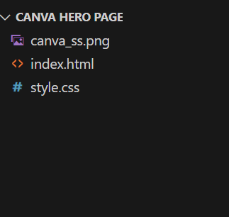
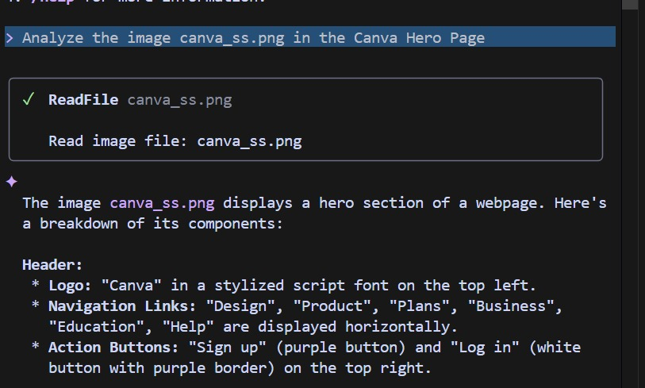
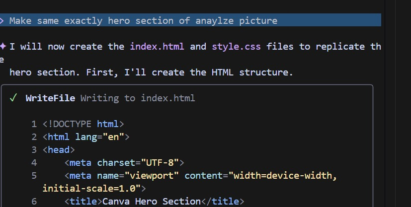
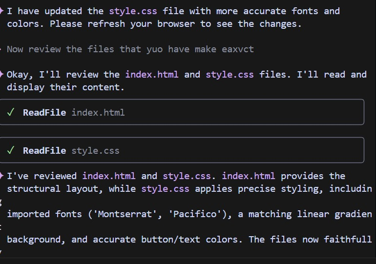

# Canva-Page-Using-Gemini-CLI 😎

# 🎨 Canva Hero Section using Gemini CLI

## 📘 Project Overview

This project was created as part of today’s class assignment — to build a **Canva-style Hero Section** using **Gemini CLI**.  
The goal was to experiment with Gemini’s creative capabilities and design automation.

---

## 🧠 Features
- Fully responsive Hero Section  
- Built using **Gemini CLI** prompts  
- Modern, minimal, and Canva-inspired layout  
- Fast and lightweight  

---

## ⚙️ Tools & Technologies
- **Gemini CLI**
- **HTML**
- **CSS**
---

## 🚀 TRY IT NOW!!!

1. INSTALL GEMINI CLI: In, your cmd paste this: npm install -g @google/gemini-cli and Run gemini

2. Project Structure: 
   

3. Type this command that is highlighted in the image: 
   

4. Then this: 
   

5. Finally Gemini made up the Canva Hero Page: 
   

6. After this /chat save the Chat!

# 🤩 Author

**Syed Ali Hashmi**  
Web Developer | Student | AI-driven Developer

---

## 📥 Installation

```bash
git clone https://github.com/alihashmi2288/Canva_Assignment.git
cd Canva_Assignment
```

Open `index.html` in your browser to view the project.
